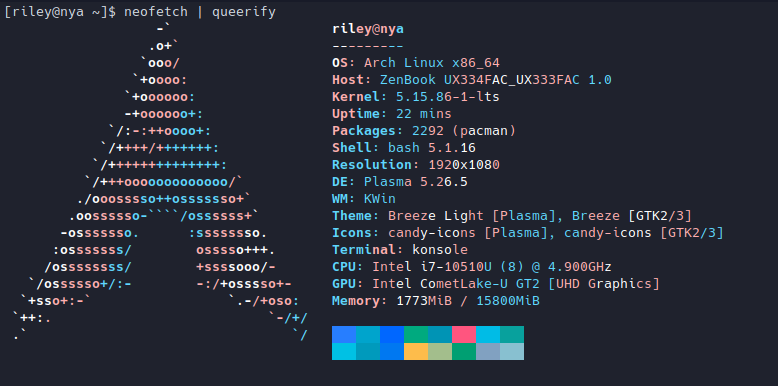

<a href='https://ko-fi.com/barrulik' target='_blank'>
 
## General info about me:
 - My name is Bar and im 18 years old.
 - My favorite programming language is java.

### Things that I know how to program:
 - Discord bots, if u ask nicely, most likely that I will make you one for free.
 - Telegram bots.
 - Minecraft bots.
 - Websites.
 - Minecraft hack clients.
 - Minecraft mods.
 - Games.

### What am I going to learn in the future:
 - Doc, its time to fire up the time mechine.

### The programing languages I'm familiar with:
 - Javascript
 - Java
 - Python
 - Html/Css
 - Kotlin
 - C#
 - C++

## I use arch btw

 
## Donate me:

## Contact me:
 - Discord: Barrulik
 - Mail: barrulik@gmail.com
#

